# zsh

## setup

```sh
echo "~/.zshenv"
export ZDOTDIR=$HOME/dotfiles/terminal/zsh/zdotdir
. $ZDOTDIR/.zshenv
```

<https://unix.stackexchange.com/a/71258>

print -rl -- $fpath

# start sequence

source:
- <https://superuser.com/users/1764454>
- <https://superuser.com/a/1840396/359978>
- [https://mermaid.live](https://mermaid.live/edit#pako:eNq9VduK2zAQ_RUjWGhh3Ky82dwKfWpgF9JSkrfUfVBtJTGxpSDLgTSbfnt1sR1LTpelDw2ESHPOSCdHo9EZJTylaIbCMIyZzGROZ8F69RSUkghZHYJNltMyZgbeCnLYBYtlzAL1yTO2X8lTToOUbkiVS5Uj-J7OFO0UM0v6Ve7OMVqXuxhdmljOtxlT0YX-NXEdZZwtauArZ2HugBmTVJBEZkeq8OfrrJv-7JD0IplHbDUFYfjJ6nBDjQhHqkG6S3mQu7X7b27nOqif7rsbNb4GgqYfffShRbkgbEt7hGFL2ApKWQ9_bPGfeaXTLYHKZM6O32M0UKOB8kd_KTvG6EdL-Ca4Lg-HdLCxLm2ZeMuIpAsbJxxGffYOhVfS56iQIVnajhfUKv49-OBp1dhVrMZ9mZphdNrkjkKNNBI16IqrUauuhl1d5amUtJj33PIVWN6Tr7SmBe8YVxeMVyKh6fvO8nd3thKhX2W9gCk3e7BmWFvmgvXuZuprb7PquZu5TFp8mbjQtdpbO6-EF84Ca9tLx89OqjbUq9oRjGECU8D3gDHgCPAD4CHgR8Aj7774PjGvMdxoH__Frr96oqT-qy14DHgCeArRPUQYogiiGw2i3YY1jfb16nmTETdOv9PDhhA9QjSCaNxrR7fUvOGMXhXV2XkC0dRvcQhQQUVBslS9fGedEiO5o4W6jTM1TInYxyhmF8UjleSrE0vQbEPykgKqDimR9HNG1DNXeNF5mkku2iA10y_2gTXvLKADYWvOm8TLH1AudVE)

```mermaid
---
title: ZSH startup files
---
graph LR
    linkStyle default stroke:gray

    zsh{"Zsh"}

    login{"Login"}
    nonLogin{"Non-login"}
    interactive{"Interactive"}
    nonInteractive{"Non-interactive"}

    zsh --> login
    zsh --> nonLogin

    login --> interactive
    login --> nonInteractive
    nonLogin --> interactive
    nonLogin --> nonInteractive

    linkStyle 2 stroke: red;
    linkStyle 3 stroke: orange;
    linkStyle 4 stroke: green;
    linkStyle 5 stroke: blue;

    etcEnv["/etc/zsh/zshenv"]
    etcProfile["/etc/zsh/zprofile"]
    etcRc["/etc/zsh/zshrc"]
    etcLogin["/etc/zsh/zlogin"]
    etcLogout["/etc/zsh/zlogout"]

    homeEnv["~/.zshenv"]
    homeProfile["~/.zprofile"]
    homeRc["~/.zshrc"]
    homeLogin["~/.zlogin"]
    homeLogout["~/.zlogout"]

    systemEtcProfile["/etc/profile"]
    systemHomeProfile["~/.profile (not sourced)"]

    %% login, interactive
    interactive
     --> etcEnv --> homeEnv
     --> etcProfile --> systemEtcProfile --> homeProfile
     --> etcRc --> homeRc
     --> etcLogin --> homeLogin
     -->|on logout| homeLogout --> etcLogout
    linkStyle 6,7,8,9,10,11,12,13,14,15,16 stroke: red;

    %% login, non-interactive
    nonInteractive
     --> etcEnv --> homeEnv
     --> etcProfile --> systemEtcProfile --> homeProfile
     --> etcLogin --> homeLogin
    %%  -->|on logout| homeLogout --> etcLogout
    linkStyle 17,18,19,20,21,22,23 stroke: orange;

    %% non-login, interactive
    interactive --> etcEnv --> homeEnv
     --> etcRc --> homeRc
    linkStyle 24,25,26,27 stroke: green;

    %% non-login, non-interactive
    nonInteractive --> etcEnv --> homeEnv
    linkStyle 28,29 stroke: blue;
```


